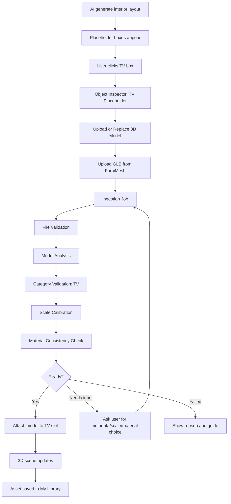
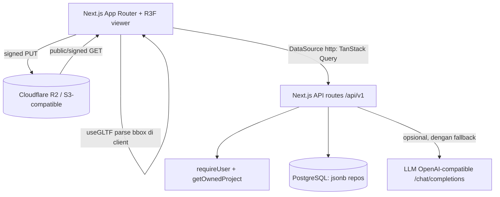

# PRD & Implementation Spec — FurniMesh-Aware 3D Model Ingestion for AI Interior Platform

> **Revisi keselarasan (2026-06-28):** diselaraskan dengan codebase Baruma nyata (monolith Next.js App Router + Postgres jsonb + Auth.js, bukan FastAPI/Redis/S3 greenfield) dan spek **AI LLM OpenAI-compatible** (reuse `src/lib/server/llm.ts`). Baca **§2.1** (peta reuse kode existing) dan **§10** (stack, AI LLM, storage) lebih dulu — keduanya mengikat seluruh PRD.

## 1. Nama Modul

**FurniMesh-Aware Model Ingestion & Semantic Slot Replacement**

Nama internal:
`furnimesh-model-ingestion-module`

Nama user-facing:
**Upload Model 3D Furniture**

## 2. Ringkasan Modul

Modul ini memungkinkan user mengubah placeholder furniture berbentuk box hasil AI interior layout menjadi model 3D realistis yang diupload sendiri oleh user. Fokus awal adalah workflow dengan file `.glb` dari FurniMesh.

Platform kita tetap fokus pada:

* AI layout rumah.
* AI tata ruang/interior.
* semantic placeholder slot.
* validasi ruang, ukuran, style, dan material.
* 2D/3D preview.
* RAB/schedule.
* export contractor/interior pack.

FurniMesh diposisikan sebagai external source/tool yang membantu user mendapatkan model 3D furniture. User dapat membuat atau mengunduh model dari FurniMesh, lalu mengupload file `.glb` ke platform kita. Platform kita akan melakukan ingestion, validasi, metadata enrichment, scale calibration, material consistency check, dan attach model ke placeholder slot yang sesuai.

## 2.1 Keselarasan dengan Codebase Baruma Saat Ini (WAJIB DIBACA)

PRD ini diselaraskan dengan arsitektur Baruma yang sudah ada. Jangan memperlakukan modul ini sebagai greenfield.

**Stack nyata Baruma (bukan microservice terpisah):**

* **Monolith Next.js (App Router)** — frontend + backend dalam satu app. "Backend" = route handler di `src/app/api/v1/...`, bukan FastAPI/NestJS.
* **PostgreSQL** diakses langsung dari route via repo di `src/lib/server/repo/*` (payload `jsonb`). Migrasi: `db/migrations/NNNN_*.sql`.
* **Data layer pattern wajib:** `DataSource` contract (`src/lib/data/source.ts`) → impl `mock` + `http` → TanStack Query hooks (`src/lib/api/hooks.ts`). Jangan bikin REST lepas di luar pola ini.
* **Auth.js**: tiap route wajib `requireUser` + `getOwnedProject` (ownership check).
* **Deploy**: pm2 di droplet via GitHub Actions (`git reset --hard origin/main`), runtime `NEXT_PUBLIC_DATA_SOURCE=http`.
* **TIDAK ADA** Redis, S3 internal, worker terpisah, FastAPI, atau pgvector di stack sekarang. Tambahkan hanya bila benar-benar perlu (lihat §10).

**Komponen yang DIMINTA PRD ini SUDAH ADA — reuse, jangan bikin ulang:**

| Kebutuhan PRD | Sudah ada di Baruma |
| --- | --- |
| Placeholder box → model 3D realistis (GLB→fallback) | `FurnitureModel` (`src/components/preview-3d/furniture-model.tsx`) — GLB → prosedural → box |
| Fit/normalisasi model ke slot (bbox → skala, alas di lantai) | `computeFitTransform` (`src/lib/three/fit-transform.ts`) |
| Fallback placeholder saat GLB gagal/loading | Suspense + ErrorBoundary → model prosedural (sudah di `FurnitureModel`) |
| Registry model per-item + resolver sumber | `FURNITURE_MODEL_REGISTRY` / `resolveFurnitureSource` (`src/lib/three/furniture-models.ts`) |
| Model prosedural per kategori (saat tak ada GLB) | `furniture-procedural.tsx` |
| Thumbnail/preview model 3D di picker | `FurniturePreview` (`src/components/preview-3d/furniture-preview.tsx`) |
| Klik placeholder + seleksi + inspector | hitbox `FurnitureModel` + sidebar `PreviewControls` |
| Drag furnitur di 3D | sudah ada (`worldToRoomLocal` + drag handlers) |
| Persistensi penempatan furnitur | tabel `project_interiors` (jsonb) + `interior-store` |
| Decoder Draco | `public/draco/*` + `useGLTF(url, "/draco/")` |

**Konsekuensi alignment inti:** modul ini = mengubah **registry model statis** menjadi **registry per-user/per-project (hasil upload)**, dan menambah lapisan **upload + validasi + asset library + material consistency** di atas pipeline 3D yang sudah jalan. "Scale calibration" = user mengisi `dims` nyata yang masuk ke `computeFitTransform`. "Semantic slot" memetakan ke `PlacedFurniture` di dalam `RoomInteriorPlan` (lihat §11).

**Catatan framework:** `AGENTS.md` menegaskan "This is NOT the Next.js you know — baca `node_modules/next/dist/docs` sebelum menulis kode". Semua pola Next.js di PRD ini tunduk pada konvensi versi Next di repo.

## 3. Validated Product Assumption

### 3.1 Assumption yang Valid

Plan ini valid karena:

1. FurniMesh menyediakan workflow image-to-3D furniture.
2. FurniMesh mendukung format GLB.
3. GLB cocok untuk web 3D viewer.
4. Platform kita bisa load GLB di React Three Fiber/Three.js.
5. User bisa membawa model sendiri.
6. Platform kita bisa melakukan ingestion/validation setelah upload.
7. Placeholder interior hasil AI bisa dijadikan semantic slot.

### 3.2 Assumption yang Tidak Boleh Dibuat

Jangan mengasumsikan:

1. FurniMesh punya public API untuk generate/download otomatis.
2. Platform kita boleh mengambil model user dari akun FurniMesh tanpa izin.
3. Semua file FurniMesh pasti scale-nya benar.
4. Semua file FurniMesh pasti cocok dengan slot yang dipilih.
5. Semua model yang diupload user punya lisensi redistribusi.
6. Semua material/texture bawaan model pasti cocok dengan Design DNA project.
7. Model GLB yang valid secara format pasti ringan untuk browser.

### 3.3 Keputusan Implementasi MVP

MVP menggunakan **manual FurniMesh-assisted flow**:

```text
User buka platform kita
→ AI generate interior layout dengan placeholder box
→ user klik placeholder, misalnya TV
→ user diarahkan/diingatkan cara mendapatkan model GLB dari FurniMesh
→ user upload file GLB
→ platform melakukan ingestion dan validasi
→ jika valid, model attach ke slot TV
→ jika butuh input, user isi ukuran/kategori/lisensi/material mode
→ model masuk personal asset library
```

Direct FurniMesh API integration disimpan sebagai future enhancement.

## 4. Product Goal

Modul ini harus membuat customer bisa:

1. Menggunakan layout/interior AI tanpa harus punya skill 3D.
2. Melihat placeholder furniture sebagai objek bermakna, bukan box kosong.
3. Klik placeholder dan upload model 3D yang relevan.
4. Mendapat validasi apakah model cocok untuk slot tersebut.
5. Mengoreksi scale, orientasi, kategori, dan material dengan mudah.
6. Memakai model dari FurniMesh secara konsisten di interior scene.
7. Menjaga warna/design/texture tetap selaras dengan Design DNA project.
8. Menyimpan model ke personal asset library.
9. Menggunakan ulang model pada project/ruangan lain.
10. Mendapat panduan akurat untuk mendapatkan model dari FurniMesh.

## 5. Non-Goals MVP

MVP tidak bertujuan untuk:

1. Menyediakan katalog model 3D platform yang lengkap.
2. Mengambil data langsung dari akun FurniMesh user.
3. Membuat generator 3D sendiri.
4. Mengonversi semua format 3D.
5. Mengedit mesh secara kompleks.
6. Melakukan retopology otomatis.
7. Membuat material editing profesional seperti Blender.
8. Memberi legal opinion final tentang lisensi.
9. Menjamin model user aman untuk redistribusi publik.
10. Menyediakan marketplace asset.

## 6. Entitas Utama yang Harus Dipahami AI Agent

AI agent/coding agent harus memahami entitas berikut.

## 6.1 Platform Kita

Platform kita adalah aplikasi web AI untuk:

* membuat layout rumah;
* membuat tata ruang/interior;
* membuat placeholder furniture;
* mengatur 2D/3D scene;
* melakukan validasi ruang;
* melakukan ingestion model user;
* menyelaraskan material dengan Design DNA;
* menghitung estimasi biaya;
* membuat export pack.

Platform kita bukan FurniMesh dan tidak mengklaim memiliki model dari FurniMesh.

## 6.2 FurniMesh

FurniMesh adalah external tool/source yang user gunakan untuk:

* generate model 3D furniture dari foto;
* download model dalam format GLB/OBJ/SKP/BLEND;
* browse model furniture;
* convert format 3D.

Dalam platform kita, FurniMesh diperlakukan sebagai:

* recommended external model source;
* guide-center entity;
* possible source metadata;
* bukan internal API dependency di MVP.

## 6.3 Semantic Slot

Semantic slot adalah placeholder box hasil AI layout yang memiliki makna.

Contoh:

* `slot_type = tv`
* `slot_type = sofa`
* `slot_type = coffee_table`
* `slot_type = rug`
* `slot_type = plant`
* `slot_type = floor_lamp`

Slot berisi:

* kategori furniture;
* room context;
* posisi;
* orientasi;
* dimensi ekspektasi;
* validasi kategori;
* placement mode;
* current attached asset.

Slot bukan hanya geometry box.

## 6.4 User Asset

User asset adalah model 3D yang diupload user ke platform.

Status user asset:

* uploaded
* validating
* needs_metadata
* needs_scale
* needs_material_mapping
* ready
* attached
* rejected
* failed

## 6.5 Ingestion Job

Ingestion job adalah background process yang mengecek file upload.

Job melakukan:

* file validation;
* GLB load test;
* mesh/material extraction;
* bounding box analysis;
* category validation;
* scale calibration check;
* performance analysis;
* thumbnail generation;
* material analysis;
* metadata enrichment;
* embedding generation;
* asset save;
* slot attachment.

## 6.6 Design DNA

Design DNA adalah aturan konsistensi desain project.

Berisi:

* style;
* mood;
* color palette;
* material tokens;
* forbidden colors/materials;
* lighting tone;
* budget level;
* consistency rules.

Semua model upload harus dicek terhadap Design DNA.

## 7. User Experience

## 7.1 Main UX Flow

```text
1. User generate interior layout.
2. Platform menampilkan furniture placeholder dalam bentuk box.
3. User klik box, misalnya TV.
4. Inspector muncul: “TV Placeholder”.
5. User klik “Upload / Replace 3D Model”.
6. Upload dialog muncul dengan requirement khusus TV.
7. User upload file `.glb` dari FurniMesh.
8. Sistem menjalankan ingestion di background.
9. Sistem menampilkan progress validasi.
10. Jika file valid tetapi ukuran belum diketahui, user isi scale.
11. Jika material tidak matching, user pilih mode material.
12. Jika kategori cocok, sistem attach model ke TV slot.
13. Placeholder box diganti model 3D.
14. Model masuk personal asset library.
15. Scene, RAB, dan schedule update.
```

## 7.2 UX Flow Mermaid



## 8. UX Detail

## 8.1 Placeholder Box Interaction

When user hovers over a placeholder:

* outline highlight;
* label appears;
* tooltip: “TV Placeholder — click to replace with 3D model.”

When user clicks:

* object selected;
* right inspector opens;
* camera optionally focuses object;
* slot metadata displayed.

## 8.2 Object Inspector — TV Example

```text
Selected Object
------------------------------------------------
TV Placeholder

Room: Ruang Tamu
Slot Type: TV
Placement: Wall-mounted
Expected Size: 120cm × 8cm × 70cm
Current Model: Basic box

Actions:
[Upload 3D Model]
[Choose from My Library]
[Use FurniMesh Guide]
[Keep Placeholder]

Model Requirements:
✓ Recommended format: GLB
✓ Expected category: TV / display
✓ Recommended file size: <10MB
✓ Max file size: 20MB
✓ Must know real-world size
✓ Must confirm usage rights
```

## 8.3 Upload Dialog

```text
Upload Model for TV
------------------------------------------------
This slot expects a TV/display model.

Drop .glb file here

Recommended:
- GLB format
- File size under 10MB
- Flat screen-like object
- Real-world scale known
- You have rights to use the model

[View FurniMesh guide]
[Cancel]
```

## 8.4 Validation Progress UI

Progress states:

1. Uploading file.
2. Validating GLB.
3. Reading mesh.
4. Calculating bounding box.
5. Checking if model fits TV.
6. Checking performance.
7. Extracting materials.
8. Comparing with project style.
9. Generating thumbnail.
10. Saving to asset library.
11. Attaching to slot.

UI copy:

```text
Checking if this model can be used as TV...
```

## 8.5 Needs Scale Confirmation UI

```text
Scale Confirmation
------------------------------------------------
The model looks valid, but we need real-world size.

Detected raw bounding box:
Width: 1.00 units
Depth: 0.05 units
Height: 0.56 units

Enter real size:
Width: [1.20] m
Depth: [0.08] m
Height: [0.70] m

[Apply Scale & Continue]
```

## 8.6 Category Warning UI

If user uploads sofa to TV slot:

```text
This model may not match the selected TV slot.

Reasons:
- Model is too deep for TV.
- Width/depth ratio does not look like a TV.
- Object shape looks closer to sofa/table than display.

Options:
[Upload another file]
[Use as another category]
[Force use with warning]
```

Force use should be allowed only if file is technically valid, but output must show warning.

## 8.7 Material Matching UI

```text
Material Consistency
------------------------------------------------
Project style: Modern Tropical Warm

Detected materials:
1. Screen_Black — matching
2. Frame_Silver — acceptable
3. Stand_Gold — not matching

Recommended:
- Screen: black glass
- Frame: matte black
- Stand: matte black or warm wood

Choose material mode:
( ) Keep original
( ) Match project style
( ) Customize manually

[Apply & Attach Model]
```

Default mode: Match project style.

## 9. Functional Requirements

## 9.1 Semantic Slot System

### Requirement

Each AI-generated placeholder must be saved as semantic slot.

Slot must contain:

* id;
* project_id;
* room_id;
* slot_type;
* label;
* placement_type;
* position;
* rotation;
* expected_dimensions;
* validation_profile;
* current_asset_id;
* material_policy;
* status.

### Slot Types MVP

MVP supports:

1. TV
2. Sofa
3. Coffee table

Future:

* rug;
* plant;
* floor lamp;
* side table;
* cabinet;
* bed;
* dining table;
* chair;
* wardrobe;
* kitchen cabinet;
* toilet;
* sink.

### Acceptance Criteria

* Every placeholder object in scene is clickable.
* Inspector shows semantic information.
* Slot type determines upload validation profile.
* Slot can attach and detach asset.
* Slot can fallback to placeholder if asset fails.

## 9.2 Upload Model

### Requirement

User can upload GLB file to replace selected slot.

MVP accepts:

* `.glb` only.

Future accepts:

* `.gltf + textures`;
* `.obj`;
* `.fbx`;
* `.blend`.

### Upload Constraints

MVP:

* accepted extension: `.glb`;
* max file size: 20MB;
* recommended file size: <=10MB;
* upload via signed URL;
* asset private by default;
* must confirm usage rights.

### Acceptance Criteria

* User can upload GLB.
* Upload shows progress.
* Invalid extension rejected immediately.
* Oversized file rejected before ingestion.
* Upload does not block editor UI.
* Slot remains usable if upload fails.

## 9.3 Ingestion Job

### Requirement

Each upload creates ingestion job.

Job must:

* validate file format;
* load GLB server-side or worker-side;
* extract basic metadata;
* calculate bounding box;
* check performance;
* validate category against slot;
* generate thumbnail;
* store file metadata;
* request user input if needed;
* save ready asset;
* attach to slot if successful.

### Ingestion Status

```text
uploaded
validating_file
analyzing_model
needs_metadata
needs_scale
needs_material_mapping
validating_category
ready
attached
warning
failed
rejected
```

### Acceptance Criteria

* Job status is queryable.
* Frontend can poll job status.
* Failed job returns actionable error.
* Needs-input job returns required fields.
* Ready job can attach asset to slot.

## 9.4 TV Validation Profile

### Requirement

If selected slot is TV, uploaded model must be validated as TV-like object.

### TV Rules

Recommended:

* width > height;
* width/depth ratio high;
* depth small relative to width;
* expected real depth <= 0.25m;
* expected width 0.7m–2.5m;
* expected height 0.35m–1.5m;
* can be wall-mounted or cabinet-mounted;
* category metadata should be tv/display/screen.

### Validation Output

```json
{
  "target_category": "tv",
  "status": "valid_with_input_required",
  "confidence": 0.82,
  "checks": [
    {
      "name": "file_loadable",
      "status": "passed"
    },
    {
      "name": "shape_ratio_tv_like",
      "status": "passed"
    },
    {
      "name": "real_world_scale",
      "status": "needs_input"
    }
  ],
  "required_user_inputs": ["real_width_m", "real_depth_m", "real_height_m"]
}
```

### Acceptance Criteria

* TV-like model passes with high or medium confidence.
* Non-TV-like model shows warning.
* Missing scale triggers needs_scale.
* User can confirm/override category with warning.
* File corrupt always fails.

## 9.5 Sofa Validation Profile

### Sofa Rules

Recommended:

* width 1.2m–4.0m;
* depth 0.6m–1.5m;
* height 0.6m–1.3m;
* width/depth ratio lower than TV;
* floor placement;
* category sofa/seat/couch.

### Acceptance Criteria

* Sofa slot rejects very flat TV-like model as mismatch warning.
* Sofa model requires floor placement.
* Uploaded model scale can fit room clearance.

## 9.6 Coffee Table Validation Profile

### Coffee Table Rules

Recommended:

* height 0.25m–0.6m;
* width 0.4m–1.5m;
* depth 0.3m–1.0m;
* floor placement;
* category table/coffee_table.

### Acceptance Criteria

* Coffee table slot detects if model too tall.
* Model must sit on floor.
* Model cannot block circulation beyond allowed threshold.

## 9.7 Personal Asset Library

### Requirement

Uploaded and validated models must be saved to user’s private asset library.

Fields:

* asset id;
* owner id;
* name;
* category;
* source;
* model URL;
* thumbnail URL;
* file size;
* dimensions;
* scale factor;
* tags;
* license confirmation;
* material map;
* status.

### Acceptance Criteria

* User can open “My Library”.
* User can reuse uploaded TV model for another TV slot.
* User can rename asset.
* User can delete asset if not used.
* Deleting attached asset asks confirmation.

## 9.8 FurniMesh Guide Center

### Requirement

The platform must provide clear guide for using FurniMesh models.

Guide must explain:

1. What FurniMesh is.
2. When to use FurniMesh.
3. How to generate model from photo.
4. Recommended download format: GLB.
5. How to upload to platform.
6. What makes a good source photo.
7. How to check model scale.
8. How to handle material/style mismatch.
9. License confirmation responsibility.
10. Troubleshooting.

### Guide Copy Structure

Page:
`/app/guides/furnimesh`

Sections:

* Overview.
* Step-by-step FurniMesh workflow.
* Recommended GLB settings.
* Model quality checklist.
* Licensing checklist.
* Upload troubleshooting.
* Category-specific tips:

  * TV
  * Sofa
  * Coffee table
  * Lamp
  * Cabinet

### Acceptance Criteria

* Upload modal links to relevant guide.
* Guide is accessible from sidebar/help.
* Slot-specific guide opens relevant anchor.
* Guide does not claim official partnership unless it exists.
* Guide states user must have rights to use uploaded model.

## 9.9 Material Consistency System

### Requirement

Uploaded GLB material must be compared with project Design DNA.

Modes:

1. Keep Original.
2. Match Project Style.
3. Customize.

Default:

* Match Project Style.

### Material Analysis

System should extract:

* material names;
* dominant colors where possible;
* roughness/metalness if available;
* texture count;
* texture size;
* material count.

### Material Token System

Each project has tokens:

* fabric.primary
* fabric.secondary
* wood.primary
* wall.base
* accent.primary
* metal.accent
* screen.black_glass
* stone.cream
* floor.primary

### Category-Specific Material Policy

TV:

* screen → screen.black_glass
* frame → metal.matte_black or dark_gray
* stand → metal.matte_black or wood.primary

Sofa:

* fabric → fabric.primary or fabric.secondary
* legs → wood.primary or metal.accent

Coffee table:

* top → wood.primary, glass.clear, stone.cream
* legs → wood.primary or metal.accent

### Acceptance Criteria

* User can keep original material.
* User can auto-match material to project style.
* User can manually map detected material to token.
* 3D viewer updates material override.
* Consistency score updates.
* Original material config is not destroyed.

## 9.10 Consistency Score

### Requirement

Each attached asset must receive consistency score.

Score components:

* category match: 25
* size/scale match: 20
* color palette match: 20
* material match: 15
* style tag match: 10
* performance suitability: 10

Result:

* 90–100: Excellent match.
* 75–89: Good match.
* 50–74: Needs adjustment.
* <50: Poor match.

### Acceptance Criteria

* Score shown in inspector.
* Low score shows actionable recommendations.
* Score recalculates after material override.
* Score stored in asset-slot mapping.

## 10. Technical Architecture

## 10.1 Stack (selaras dengan Baruma — bukan microservice)

Baruma adalah **monolith Next.js**. Tidak ada backend/worker/Redis terpisah. Gunakan yang sudah ada:

Frontend (sudah dipakai):

* Next.js App Router + TypeScript
* shadcn/ui + Tailwind
* Zustand (`src/stores/*`) + TanStack Query (`src/lib/api/*`)
* React Three Fiber 9 + Drei 10 + three 0.184 (sudah terpasang)

Backend = bagian dari app Next.js yang sama (sudah dipakai):

* Route handler `src/app/api/v1/...` (bukan FastAPI/NestJS)
* PostgreSQL via `src/lib/server/db.ts` + repo `src/lib/server/repo/*` (payload `jsonb`)
* Auth.js (`requireUser`, `getOwnedProject`) di setiap route
* `DataSource` contract (mock + http) + hooks — semua data lewat sini

3D (sudah dibangun — reuse):

* GLB/glTF via `useGLTF` (Drei) + decoder Draco lokal di `public/draco/`
* `FurnitureModel` (GLB→prosedural→box), `computeFitTransform`, `FurniturePreview`

Komponen BARU yang perlu ditambah untuk modul ini:

* **Object storage eksternal untuk file upload** — wajib di luar git checkout (lihat §10.4). Rekomendasi: **Cloudflare R2** (S3-compatible). Ini satu-satunya infra baru yang benar-benar perlu.
* (Opsional, hanya jika perlu) lapisan job ingestion **in-process di route Next.js** — bukan Redis/worker (lihat §14).

Tidak menambah: Redis, FastAPI/NestJS, Python worker, pgvector, Blender worker (semua di-defer ke V2+ jika benar-benar dibutuhkan).

## 10.2 Architecture Diagram (aligned)



Catatan: analisis bounding box & load-test GLB dilakukan **di client** (drei `useGLTF` + `THREE.Box3`, sama seperti `computeFitTransform`), bukan worker server. Server hanya validasi ekstensi/ukuran + simpan metadata + (opsional) panggil LLM untuk material/semantic dengan fallback deterministik.

## 10.3 AI LLM Integration (OpenAI-compatible)

**Client:** `src/lib/server/llm.ts` (server-only, sudah ada). Endpoint **OpenAI-compatible**: `POST {LLM_BASE_URL}/chat/completions`, header `Authorization: Bearer {LLM_API_KEY}`, dan `response_format: { type: "json_object" }` untuk output terstruktur. Sudah menyediakan `chatJSON<T>()` (JSON mode) dan `chatText()` (balasan teks asisten).

**Provider-agnostic (swappable).** Saat ini base URL di-hardcode ke NVIDIA NIM. Alignment kecil yang diperlukan: jadikan base URL configurable agar benar-benar OpenAI-compatible/swappable (NVIDIA → OpenAI → AgentRouter → lainnya tanpa ubah kode). Generalisasi env (alias `NVIDIA_*` lama tetap didukung untuk kompat):

```text
LLM_BASE_URL          (default https://integrate.api.nvidia.com/v1)
LLM_API_KEY           (fallback: NVIDIA_API_KEY)
LLM_MODEL             (reasoning/JSON, default nvidia/llama-3.3-nemotron-super-49b-v1.5)
LLM_ASSISTANT_MODEL   (chat cepat, default meta/llama-3.1-8b-instruct)
```

**Kontrak wajib:** SEMUA pemakaian LLM HARUS punya **fallback deterministik**. `chatJSON`/`chatText` mengembalikan `null` saat gagal (key kosong, HTTP error, JSON rusak, timeout) → modul memakai aturan geometris/heuristik. LLM hanya **mempertajam**, tidak pernah jadi single point of failure, dan tidak pernah dipakai untuk gating yang harus pasti.

**Pemakaian LLM di modul ini (semua dengan fallback):**

* **Material → Design DNA mapping (§9.9):** `chatJSON` memetakan nama material terdeteksi ke token proyek + rekomendasi override. *Fallback:* tabel token per-kategori di §9.9 (deterministik).
* **Semantic category assist (§9.4):** `chatJSON` menilai apakah nama mesh/material "TV-like" untuk menaikkan confidence. *Fallback & primary:* aturan rasio geometris (§9.4) tetap jadi penentu utama; LLM hanya tambahan.
* **Auto name/tags/style asset (§9.7)** dari metadata model: `chatJSON`.
* **AI assistant copy (§17.1):** `chatText`.

**JANGAN pakai LLM untuk:** validasi ukuran/bounding box, fit math (`computeFitTransform`), atau gating lisensi — itu deterministik / konfirmasi eksplisit user.

## 10.4 Storage & Deploy Constraint (KRITIS)

Deploy Baruma menjalankan `git reset --hard origin/main` di `/opt/baruma/app` (`.github/workflows/deploy.yml`). Artinya **file apa pun di dalam app dir yang tidak ter-commit AKAN TERHAPUS saat deploy berikutnya**. Maka:

* **Upload user TIDAK BOLEH disimpan di `public/` atau folder app mana pun.** Wajib di **object store eksternal (R2/S3)** atau volume yang di-mount di luar git checkout.
* Rekomendasi MVP: **Cloudflare R2** (S3-compatible, sekaligus OpenAI-compatible S3 API), private bucket, akses via signed URL (upload `PUT`, baca via signed/short-lived `GET` atau CDN). `model_url`/`thumbnail_url` di DB menunjuk ke R2.
* Aset GLB statis platform (mis. `public/models/bed.glb`) yang sengaja di-commit tetap aman; ini hanya berlaku untuk **upload runtime user**.

## 11. Database Schema

**Alignment:** ikuti pola Baruma — migrasi SQL di `db/migrations/NNNN_*.sql` (mirror gaya `0004_interior.sql`: `references projects(id) on delete cascade`, trigger `set_updated_at()`), dan **pakai `jsonb` untuk payload yang terikat plan**. UUID di skema di bawah boleh disesuaikan ke konvensi id repo (`text` id seperti tabel existing). Semua akses lewat repo `src/lib/server/repo/*` + ownership check.

Keputusan penting:

* **`user_assets`** dan **`asset_ingestion_jobs`** = tabel beneran (data per-user, query-able). Pakai skema di §11.2/§11.3 (sesuaikan tipe id).
* **`asset_slots`** dan **`asset_slot_attachments`** = JANGAN tabel terpisah yang lepas dari plan. Slot pada dasarnya adalah `PlacedFurniture` di dalam `RoomInteriorPlan` yang sudah dipersist di tabel **`project_interiors` (jsonb)**. "Attach asset ke slot" = menambah field pada item furniture di `SavedInterior`, mis. `modelAssetId` / `modelUrl` / `materialMode` / `fitMode` / `scaleFactor`. Ini menjaga satu sumber kebenaran untuk layout+interior+asset, dan otomatis ikut autosave yang sudah ada. Tabel `asset_slots`/`asset_slot_attachments` di bawah disimpan sebagai **referensi konsep** (boleh dipakai hanya jika nanti perlu query slot lintas-plan), bukan kebutuhan MVP.

### 11.1 asset_slots (konsep — di MVP diwujudkan sebagai field pada `SavedInterior`)

```sql
CREATE TABLE asset_slots (
  id UUID PRIMARY KEY,
  project_id UUID NOT NULL,
  room_id UUID NOT NULL,
  slot_type TEXT NOT NULL,
  label TEXT NOT NULL,
  placement_type TEXT NOT NULL,
  position_json JSONB NOT NULL,
  rotation_deg NUMERIC NOT NULL DEFAULT 0,
  expected_dimensions_json JSONB NOT NULL,
  allowed_asset_categories JSONB NOT NULL,
  validation_profile TEXT NOT NULL,
  material_policy_json JSONB,
  current_asset_id UUID NULL,
  status TEXT NOT NULL DEFAULT 'placeholder',
  created_at TIMESTAMP NOT NULL DEFAULT now(),
  updated_at TIMESTAMP NOT NULL DEFAULT now()
);
```

## 11.2 user_assets

```sql
CREATE TABLE user_assets (
  id UUID PRIMARY KEY,
  user_id UUID NOT NULL,
  name TEXT NOT NULL,
  category TEXT NOT NULL,
  source_type TEXT NOT NULL,
  source_name TEXT,
  source_url TEXT,
  original_filename TEXT NOT NULL,
  model_url TEXT NOT NULL,
  thumbnail_url TEXT,
  file_size_bytes BIGINT NOT NULL,
  width_m NUMERIC,
  depth_m NUMERIC,
  height_m NUMERIC,
  raw_bounding_box_json JSONB,
  scale_factor_json JSONB,
  style_tags JSONB DEFAULT '[]',
  color_tags JSONB DEFAULT '[]',
  material_tags JSONB DEFAULT '[]',
  room_types JSONB DEFAULT '[]',
  license_confirmation BOOLEAN NOT NULL DEFAULT false,
  license_note TEXT,
  usage_scope TEXT NOT NULL DEFAULT 'private_project_only',
  material_analysis_json JSONB,
  material_map_json JSONB,
  performance_json JSONB,
  status TEXT NOT NULL DEFAULT 'uploaded',
  created_at TIMESTAMP NOT NULL DEFAULT now(),
  updated_at TIMESTAMP NOT NULL DEFAULT now()
);
```

## 11.3 asset_ingestion_jobs

```sql
CREATE TABLE asset_ingestion_jobs (
  id UUID PRIMARY KEY,
  user_id UUID NOT NULL,
  asset_id UUID NOT NULL,
  project_id UUID,
  room_id UUID,
  slot_id UUID,
  expected_category TEXT NOT NULL,
  status TEXT NOT NULL,
  progress INT NOT NULL DEFAULT 0,
  validation_result_json JSONB,
  required_user_inputs_json JSONB,
  error_message TEXT,
  created_at TIMESTAMP NOT NULL DEFAULT now(),
  updated_at TIMESTAMP NOT NULL DEFAULT now()
);
```

## 11.4 asset_slot_attachments

```sql
CREATE TABLE asset_slot_attachments (
  id UUID PRIMARY KEY,
  project_id UUID NOT NULL,
  room_id UUID NOT NULL,
  slot_id UUID NOT NULL,
  asset_id UUID NOT NULL,
  fit_mode TEXT NOT NULL,
  scale_factor_json JSONB,
  position_adjustment_json JSONB,
  rotation_adjustment_deg NUMERIC DEFAULT 0,
  material_mode TEXT NOT NULL DEFAULT 'match_project_style',
  material_map_json JSONB,
  consistency_score NUMERIC,
  warnings_json JSONB DEFAULT '[]',
  status TEXT NOT NULL DEFAULT 'attached',
  created_at TIMESTAMP NOT NULL DEFAULT now(),
  updated_at TIMESTAMP NOT NULL DEFAULT now()
);
```

## 12. API Contract

**Alignment:** semua endpoint di bawah harus mengikuti konvensi Baruma:

* Prefix **`/api/v1/...`** (bukan `/api/...`). Project-scoped → `/api/v1/projects/[id]/...` (mirror route layout/interior yang ada).
* Tiap handler: `requireUser` + `getOwnedProject(projectId, userId)` → 404/401 sesuai pola `src/lib/server/response.ts` (`ok`/`err`/`handleError`).
* **Tambahkan method ke `DataSource` contract** (`src/lib/data/source.ts`) → impl `mock` (memori sesi) + `http` (fetch) → hook TanStack Query. Frontend memanggil hook, bukan `fetch` langsung. Mock memungkinkan dev tanpa R2/DB.
* Validasi body dengan zod (mirror `savedInteriorSchema`).
* Signed upload URL (§12.1) = signed `PUT` ke **R2/S3** (lihat §10.4), bukan storage internal app.

(Path/route di bawah ditulis ringkas; saat implementasi sesuaikan ke `/api/v1/...` + project scope + auth.)

## 12.1 Request Upload URL

```http
POST /api/assets/upload-url
```

Request:

```json
{
  "filename": "tv.glb",
  "content_type": "model/gltf-binary",
  "file_size_bytes": 4200000,
  "project_id": "uuid",
  "room_id": "uuid",
  "slot_id": "uuid"
}
```

Response:

```json
{
  "upload_url": "signed-url",
  "file_url": "s3://bucket/path/tv.glb",
  "expires_in": 900
}
```

## 12.2 Create Ingestion Job

```http
POST /api/assets/ingestion-jobs
```

Request:

```json
{
  "project_id": "uuid",
  "room_id": "uuid",
  "slot_id": "uuid",
  "expected_category": "tv",
  "file_url": "s3://bucket/path/tv.glb",
  "original_filename": "tv.glb",
  "source_name": "furnimesh",
  "source_url": "https://furnimesh.com/..."
}
```

Response:

```json
{
  "job_id": "uuid",
  "asset_id": "uuid",
  "status": "uploaded"
}
```

## 12.3 Get Ingestion Job

```http
GET /api/assets/ingestion-jobs/:jobId
```

Response:

```json
{
  "job_id": "uuid",
  "asset_id": "uuid",
  "status": "needs_scale",
  "progress": 65,
  "validation_result": {},
  "required_user_inputs": [
    "width_m",
    "depth_m",
    "height_m",
    "license_confirmation"
  ]
}
```

## 12.4 Update Asset Metadata

```http
PATCH /api/assets/:assetId/metadata
```

Request:

```json
{
  "name": "Samsung-style Wall TV",
  "category": "tv",
  "width_m": 1.2,
  "depth_m": 0.08,
  "height_m": 0.7,
  "style_tags": ["modern_tropical", "minimalist"],
  "color_tags": ["black"],
  "material_tags": ["glass", "metal"],
  "license_confirmation": true,
  "license_note": "User confirms they have rights to use this model."
}
```

## 12.5 Attach Asset to Slot

```http
POST /api/projects/:projectId/slots/:slotId/attach-asset
```

Request:

```json
{
  "asset_id": "uuid",
  "fit_mode": "fit_to_slot_width",
  "material_mode": "match_project_style",
  "material_map": {
    "Screen": "screen.black_glass",
    "Frame": "metal.matte_black"
  }
}
```

Response:

```json
{
  "attachment_id": "uuid",
  "slot_id": "uuid",
  "asset_id": "uuid",
  "consistency_score": 88,
  "warnings": []
}
```

## 12.6 Detach Asset

```http
DELETE /api/projects/:projectId/slots/:slotId/asset
```

Response:

```json
{
  "slot_id": "uuid",
  "status": "placeholder"
}
```

## 12.7 My Library

```http
GET /api/assets/my-library?category=tv
```

Response:

```json
{
  "items": [
    {
      "id": "uuid",
      "name": "Wall TV",
      "category": "tv",
      "thumbnail_url": "...",
      "width_m": 1.2,
      "depth_m": 0.08,
      "height_m": 0.7,
      "status": "ready"
    }
  ]
}
```

## 13. Frontend Component Requirements

**Alignment:** komponen rendering 3D/slot di bawah JANGAN dibangun dari nol — perluas yang sudah ada:

* `semantic-slot-object` / `slot-selection-outline` / `slot-asset-preview` → perluas **`FurnitureModel`** (sudah punya GLB→prosedural→box, hitbox klik, selection cage, drag). Tambahkan dukungan `modelUrl` per-item dari asset upload.
* `slot-inspector` / `slot-requirements-card` → perluas panel **`PreviewControls`** (sidebar 3D yang sudah ada) atau komponen inspector furnitur saat ini.
* Preview model di dialog upload & library → reuse **`FurniturePreview`**.
* State → Zustand store interior yang ada (`interior-store`) + store baru `assets-store` bila perlu; data → hooks TanStack Query (lewat `DataSource`).

Komponen di bawah yang BENAR-BENAR baru: dialog upload, form scale/metadata/lisensi, material-mapping step, panel My Library, guide page.

## 13.1 Components

```text
features/interior/slots/
  semantic-slot-object.tsx
  slot-hover-label.tsx
  slot-selection-outline.tsx
  slot-inspector.tsx
  slot-requirements-card.tsx
  slot-asset-preview.tsx

features/assets/upload/
  upload-model-button.tsx
  model-upload-dialog.tsx
  upload-dropzone.tsx
  model-validation-progress.tsx
  model-validation-result.tsx
  scale-calibration-form.tsx
  asset-metadata-form.tsx
  asset-license-confirmation.tsx
  material-mapping-step.tsx

features/assets/library/
  my-asset-library-panel.tsx
  asset-library-card.tsx
  asset-category-filter.tsx
  asset-search-input.tsx

features/guides/
  furnimesh-guide-page.tsx
  model-source-guide-card.tsx
```

## 13.2 Slot Inspector Requirements

Inspector must show:

* slot label;
* slot type;
* room;
* expected dimensions;
* current model;
* model status;
* upload button;
* choose from library button;
* guide button;
* validation warnings;
* consistency score if attached;
* detach model action.

## 13.3 Upload Dialog Requirements

Dialog steps:

1. Requirements.
2. Upload.
3. Validation Progress.
4. Metadata/Scale.
5. Material Mode.
6. Confirm Attach.
7. Success.

## 13.4 Loading & Error States

Must handle:

* upload failed;
* ingestion failed;
* GLB unreadable;
* user closes dialog during ingestion;
* job still processing;
* asset needs input;
* model failed in viewer;
* storage URL expired;
* validation warning.

## 14. Ingestion (tanpa worker terpisah — selaras Baruma)

**Alignment penting:** Baruma tidak punya Redis/worker. JANGAN buat service worker terpisah. "Ingestion job" diwujudkan sebagai:

* **Analisis GLB di CLIENT** (saat/selepas upload), memanfaatkan yang sudah ada: `useGLTF` (Drei) untuk load + `new THREE.Box3().setFromObject()` untuk bounding box (sama seperti yang dipakai `computeFitTransform`), plus hitung jumlah mesh/material/texture & ukuran file. Tidak perlu Three/Blender di server.
* **Server (route Next.js)** hanya: validasi ekstensi+ukuran (sebelum signed URL), simpan metadata hasil analisis client ke `user_assets`, jalankan validasi kategori geometris (deterministik) + opsional LLM material/semantic (§10.3, dengan fallback), set status, attach ke slot.
* **`asset_ingestion_jobs`** tetap dipakai sebagai **state machine yang dipoll frontend** (status/progress/required_inputs), tapi transisinya digerakkan oleh route call + input user, bukan background queue. Untuk langkah berat (mis. thumbnail server-side, optimisasi) → defer ke V1/V2 (saat itu boleh tambah job async). Di MVP, thumbnail bisa dari `FurniturePreview` (render mini 3D di client) lalu di-capture.

Pemetaan langkah berikut: langkah 3–7,9 (load, mesh/material count, bbox, proporsi, material names) → **client**; langkah 2,8,10–13 (validasi ekstensi/MIME, kategori, performa, simpan, status) → **route server**.

## 14.1 Ingestion Steps (client analysis + server persist)

Step 1: Download/read uploaded GLB.
Step 2: Verify extension and MIME.
Step 3: Load GLB.
Step 4: Check meshes exist.
Step 5: Count meshes/materials/textures.
Step 6: Calculate bounding box.
Step 7: Analyze proportions.
Step 8: Validate against expected category.
Step 9: Extract material names and dominant colors where possible.
Step 10: Estimate performance.
Step 11: Generate thumbnail.
Step 12: Save validation result.
Step 13: Determine next status.

## 14.2 Worker Result Status Rules

If file corrupt:

* status = failed.

If file valid but no dimensions:

* status = needs_scale.

If category mismatch:

* status = warning or needs_metadata.

If material mapping needed:

* status = needs_material_mapping.

If all required checks pass:

* status = ready.

## 14.3 Performance Checks

Fields:

* file_size_mb;
* mesh_count;
* material_count;
* texture_count;
* estimated_triangle_count if available;
* texture_resolution_max;
* load_test_passed;
* mobile_performance_risk.

Thresholds MVP:

* ideal file size: <=10MB;
* max file size: 20MB;
* material count warning: >20;
* texture warning: >2048px;
* mesh count warning: >50.

## 15. Validation Profiles

## 15.1 Common Profile

All models:

* file must be GLB;
* file must load;
* must contain mesh;
* bounding box must exist;
* must not exceed max size;
* user must confirm rights;
* dimensions must be known before attaching.

## 15.2 TV Profile

```json
{
  "category": "tv",
  "placement": ["wall_mounted", "cabinet_mounted"],
  "recommended": {
    "width_m": [0.7, 2.5],
    "depth_m": [0.02, 0.25],
    "height_m": [0.35, 1.5],
    "width_to_depth_min": 6,
    "width_to_height": [1.1, 3.2]
  },
  "material_tokens": {
    "screen": ["screen.black_glass"],
    "frame": ["metal.matte_black", "metal.dark_gray"],
    "stand": ["metal.matte_black", "wood.primary"]
  }
}
```

## 15.3 Sofa Profile

```json
{
  "category": "sofa",
  "placement": ["floor"],
  "recommended": {
    "width_m": [1.2, 4.0],
    "depth_m": [0.6, 1.5],
    "height_m": [0.6, 1.3]
  },
  "material_tokens": {
    "fabric": ["fabric.primary", "fabric.secondary"],
    "legs": ["wood.primary", "metal.accent"]
  }
}
```

## 15.4 Coffee Table Profile

```json
{
  "category": "coffee_table",
  "placement": ["floor"],
  "recommended": {
    "width_m": [0.4, 1.8],
    "depth_m": [0.3, 1.2],
    "height_m": [0.25, 0.65]
  },
  "material_tokens": {
    "top": ["wood.primary", "stone.cream", "glass.clear"],
    "legs": ["wood.primary", "metal.accent"]
  }
}
```

## 16. FurniMesh Guide Center Requirements

## 16.1 Page Route

`/app/guides/furnimesh`

## 16.2 Page Sections

1. What is FurniMesh?
2. When should you use it?
3. Recommended workflow.
4. How to generate model from photo.
5. How to choose GLB.
6. How to upload to our platform.
7. Model quality checklist.
8. Category-specific checklist.
9. Licensing responsibility.
10. Troubleshooting.

## 16.3 Guide Copy: Recommended Workflow

```text
1. Prepare a clear furniture photo.
2. Use a plain background if possible.
3. Generate the 3D model in FurniMesh.
4. Download the GLB file.
5. Return to this platform.
6. Click the matching placeholder, such as TV or Sofa.
7. Upload the GLB.
8. Confirm size and usage rights.
9. Choose material mode.
10. Attach to the placeholder.
```

## 16.4 Licensing Copy

```text
Before uploading any model, make sure you have the right to use it in your project. This platform stores uploaded models privately by default. Do not upload files you are not allowed to use.
```

## 16.5 FurniMesh Naming

Always refer to FurniMesh as:

* external model source;
* external furniture model generator;
* external GLB source.

Do not say:

* official partner;
* integrated provider;
* owned by us;
* automatically connected;
  unless official integration exists.

## 17. AI Agent Behavior Specification

AI agent must understand:

1. FurniMesh is external.
2. User brings GLB from FurniMesh.
3. Platform validates file and category.
4. Placeholder slot determines expected category.
5. Uploading model does not guarantee compatibility.
6. Model must be checked against Design DNA.
7. If model mismatches, give actionable correction.
8. Never claim model is legally safe unless user confirms rights.
9. Never claim construction-ready.
10. Keep UX simple for user.

**Implementasi:** balasan asisten ini di-render via `chatText` (LLM OpenAI-compatible, §10.3) dengan fallback ke copy statis bila LLM `null`.

## 17.1 Agent Response Examples

When user asks “can I upload this FurniMesh TV model?”:

```text
Yes. Click the TV placeholder, upload the GLB file, then the system will check whether it fits the TV slot. If the size is unknown, we’ll ask for width, height, and depth before attaching it.
```

When user uploads wrong model:

```text
This model loads successfully, but it does not look like a TV. It is too deep for the selected TV slot. You can upload another file, use it as another category, or force-use it with warning.
```

When material mismatches:

```text
The model shape fits, but the gold frame does not match your Modern Tropical palette. I recommend applying the project material token “matte black” to the frame.
```

## 18. Implementation Plan

**Alignment:** tiap phase memperluas pipeline 3D + data-layer yang sudah ada (lihat §2.1). Tambahkan Phase 0 prasyarat infra.

## Phase 0 — Prasyarat Infra (baru)

Tasks:

* Provision **Cloudflare R2** (atau S3-compatible) untuk file upload (lihat §10.4). Env: kredensial R2 + bucket.
* Generalisasi `src/lib/server/llm.ts` → base URL configurable (`LLM_BASE_URL`/`LLM_API_KEY`/`LLM_MODEL`) dengan alias `NVIDIA_*` (lihat §10.3).
* Tambah method asset/slot ke `DataSource` contract + mock + http (lihat §12).

Done when:

* File bisa di-upload ke R2 via signed URL; `llm.ts` bisa diarahkan ke provider OpenAI-compatible mana pun via env; hook data asset tersedia (mode mock jalan tanpa R2/DB).

## Phase 1 — Semantic Slots (perluas yang ada)

Catatan reuse: slot = `PlacedFurniture` di `RoomInteriorPlan` (sudah dipersist di `project_interiors`). "Klik placeholder + inspector" sudah ada via `FurnitureModel` + `PreviewControls`; tugasnya menambah metadata slot (`slot_type`/`validation_profile`/`expected_dimensions`) + field `modelAssetId` pada item.

Tasks:

* Add asset_slots data model.
* Generate semantic slots from AI layout.
* Make 3D placeholder clickable.
* Show slot inspector.
* Support TV, sofa, coffee table.

Done when:

* User can click TV box and see TV-specific inspector.

## Phase 2 — Upload UI

Tasks:

* Build upload dialog.
* Restrict file to GLB.
* Show slot-specific requirements.
* Upload to object storage via signed URL.
* Create ingestion job.

Done when:

* User can upload GLB from selected slot.

## Phase 3 — Ingestion Job

Tasks:

* Build ingestion job table/API.
* Build worker status flow.
* Validate file.
* Load GLB.
* Extract bounding box.
* Determine needs_scale/ready/failed.

Done when:

* Uploaded model returns validation status.

## Phase 4 — Category Validation

Tasks:

* Implement TV profile.
* Implement sofa profile.
* Implement coffee table profile.
* Return confidence and warnings.
* Allow force-use with warning.

Done when:

* TV slot can detect TV-like vs non-TV-like model.

## Phase 5 — Scale Calibration

Tasks:

* Build scale form.
* Store real dimensions.
* Calculate scale factor.
* Apply scale in 3D viewer.

Done when:

* User can set real-world size and model appears correct.

## Phase 6 — Attach to Slot

Tasks:

* Build attach endpoint.
* Store asset-slot mapping.
* Replace placeholder in scene.
* Detach support.

Done when:

* Placeholder box changes into uploaded GLB.

## Phase 7 — Material Consistency

Tasks:

* Extract material list.
* Add material mode UI.
* Add project material tokens.
* Apply material override in viewer.
* Calculate consistency score.

Done when:

* User can choose Keep Original vs Match Project Style.

## Phase 8 — My Asset Library

Tasks:

* Build library panel.
* Reuse ready assets.
* Filter by category.
* Attach existing asset to selected slot.

Done when:

* User can choose previously uploaded TV model.

## Phase 9 — FurniMesh Guide Center

Tasks:

* Build guide page.
* Link guide from upload dialog.
* Add category-specific tips.
* Add licensing checklist.

Done when:

* User can follow guide to get GLB from FurniMesh.

## 19. Definition of Done

MVP is done when:

* AI layout creates TV, sofa, coffee table semantic slots.
* User can click slot.
* Inspector shows correct slot metadata.
* User can upload GLB.
* Ingestion validates GLB.
* TV profile checks category compatibility.
* User can enter real dimensions.
* User can confirm license/usage rights.
* User can choose material mode.
* Model attaches to slot.
* 3D scene updates.
* Asset is saved to My Library.
* User can detach model.
* User can reuse model.
* FurniMesh guide exists.
* Errors are clear and actionable.
* Placeholder remains if upload fails.
* No crash when GLB fails.

## 20. MVP Acceptance Test Scenarios

## Scenario 1 — Valid TV Model

Given:

* user selects TV placeholder;
* uploads valid TV GLB.

Expected:

* file passes;
* category passes;
* asks scale if missing;
* user inputs dimensions;
* material mode shown;
* model attaches;
* scene updates.

## Scenario 2 — Sofa Uploaded to TV Slot

Given:

* user selects TV placeholder;
* uploads sofa GLB.

Expected:

* file loads;
* category mismatch warning;
* user can upload another file;
* user can force-use with warning;
* placeholder remains until user confirms.

## Scenario 3 — Corrupt GLB

Given:

* user uploads corrupt GLB.

Expected:

* ingestion fails;
* error message explains file unreadable;
* user can retry;
* scene unchanged.

## Scenario 4 — File Too Large

Given:

* user uploads 80MB GLB.

Expected:

* upload rejected before ingestion;
* message suggests optimizing model.

## Scenario 5 — Material Mismatch

Given:

* user uploads TV with gold frame;
* project style is modern tropical.

Expected:

* material mismatch warning;
* recommend matte black frame;
* user can apply style match;
* consistency score improves.

## Scenario 6 — Reuse Asset

Given:

* user has uploaded TV asset before.

Expected:

* user selects another TV slot;
* opens My Library;
* selects same TV;
* asset attaches without re-upload.

## 21. Risks & Mitigation

## Risk 1 — FurniMesh No Public API

Mitigation:

* MVP uses manual GLB upload.
* Guide center explains manual workflow.
* API integration is future only.

## Risk 2 — Uploaded Model Scale Unknown

Mitigation:

* Require user scale confirmation.
* Show expected slot size.
* Store scale factor.

## Risk 3 — User Uploads Wrong Category

Mitigation:

* Slot-specific validation profiles.
* Confidence score.
* Warning and correction UI.

## Risk 4 — Material Not Matching

Mitigation:

* Design DNA.
* Material tokens.
* Keep Original / Match Style / Customize modes.

## Risk 5 — Heavy Model Crashes Browser

Mitigation:

* File size limits.
* Performance analysis.
* Fallback placeholder.
* Lazy loading.
* Warnings for high mesh/material count.

## Risk 6 — License Ambiguity

Mitigation:

* Require license confirmation.
* Store source note.
* Private asset default.
* Do not allow public sharing in MVP.

## Risk 7 — User Confusion

Mitigation:

* Click object → upload flow.
* Slot-specific guide.
* Simple copy.
* Clear warnings.

## 22. Roadmap

## MVP

* Manual FurniMesh GLB upload.
* TV/sofa/coffee table slot.
* Basic GLB ingestion.
* Scale calibration.
* Slot attach.
* Material mode.
* My Library.
* FurniMesh guide.

## V1

* More categories.
* Better material extraction.
* Thumbnail generation via worker.
* Embedding metadata.
* Better consistency scoring.
* Model optimization suggestions.

## V2

* OBJ/FBX support.
* Blender conversion worker.
* Auto texture compression.
* Model repair pipeline.
* FurniMesh URL/source helper.

## V3

* Official API integration if available.
* Asset marketplace.
* Public/shared asset library.
* Vendor catalog.
* Product affiliate model.

## 23. Final Implementation Principle

The module must follow this principle:

```text
The user owns the model source.
The platform owns the layout, validation, consistency, and usability layer.
```

FurniMesh is used as a recommended external source, while the platform ensures:

* the model fits the selected furniture slot;
* the model has correct scale;
* the model works in 3D viewer;
* the model does not break design consistency;
* the model remains easy for customers to use.
