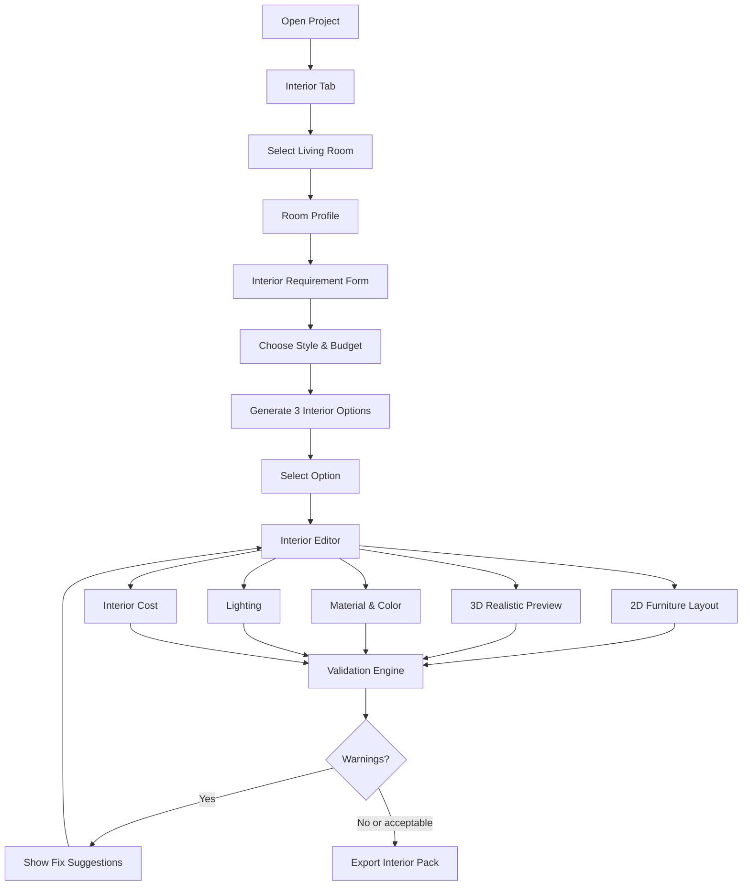

# PRD & Implementation Spec — Modul Ruang Detail + Interior Design + Realistic 3D Assets

## 1. Nama Modul

**Living Room Interior Designer Module**

Nama internal:
`living-room-interior-module`

Nama user-facing:
**Desain Interior Ruang Tamu**

## 2. Tujuan Modul

Modul ini memungkinkan user awam mendesain ruang tamu secara detail berdasarkan denah rumah yang sudah dibuat. User bisa memilih ruang tamu, mengisi kebutuhan, memilih style interior, generate beberapa opsi desain, melihat layout furniture 2D, melihat 3D realistis dengan model GLB, mengganti furniture/material/warna/lighting, melihat estimasi biaya, dan mengekspor interior pack untuk kontraktor/interior vendor.

Modul ini adalah bagian dari produk RumahCAD AI.

## 3. Masalah yang Diselesaikan

User awam biasanya:

- Punya denah tapi tidak bisa membayangkan isi ruang.
- Tidak tahu sofa ukuran berapa yang muat.
- Bingung posisi TV, meja, karpet, tanaman, lampu, dan dekorasi.
- Sering memilih furniture yang terlalu besar.
- Tidak tahu style interior yang cocok dengan ukuran rumah.
- Tidak tahu estimasi biaya interior.
- Sulit menjelaskan ke vendor interior atau tukang furniture.
- Tertipu gambar AI yang bagus tapi tidak sesuai ukuran nyata.

Modul ini menyelesaikan masalah tersebut dengan sistem yang berbasis ukuran ruang asli, bukan gambar bebas.

## 4. Prinsip Produk

Core principle:

> Interior design harus cantik, muat, nyaman, realistis, dan bisa dijadikan bahan diskusi dengan kontraktor/vendor interior.

Yang benar:

```text
Room geometry
→ furniture placement
→ clearance validation
→ realistic 3D assets
→ material selection
→ lighting setup
→ interior RAB
→ export interior pack
```

Yang tidak boleh:

```text
AI image cantik
→ dianggap desain teknis final
```

## 5. Target User

### 5.1 Homeowner Awam

User ingin:

- Melihat ruang tamu seperti nyata.
- Mengerti apakah furniture muat.
- Memilih style yang cocok.
- Tahu estimasi biaya.
- Export hasil untuk diskusi dengan keluarga/vendor.

### 5.2 Kontraktor / Vendor Interior

Vendor ingin:

- Melihat layout furniture.
- Melihat material schedule.
- Melihat furniture schedule.
- Melihat catatan ukuran.
- Melihat budget range.
- Melihat render visual.

### 5.3 Drafter / Designer Freelance

Designer ingin:

- Memakai hasil awal sebagai konsep.
- Mengedit lebih lanjut.
- Menggunakan data furniture/material sebagai starting point.

## 6. Scope MVP

### 6.1 MVP Wajib

Modul MVP harus mendukung:

1. Pilih ruang tamu dari project.
2. Tampilkan room profile:
   - ukuran ruang
   - luas
   - posisi pintu
   - posisi jendela
   - koneksi ke ruang lain

3. Form kebutuhan ruang tamu.
4. Pilih interior style.
5. Generate 3 opsi interior:
   - Hemat
   - Family Cozy
   - Premium

6. Pilih salah satu opsi.
7. Tampilkan 2D furniture layout.
8. Tampilkan 3D realistic preview.
9. Load model GLB untuk furniture utama.
10. Drag/drop furniture di 2D.
11. Update posisi furniture di 3D.
12. Ganti material lantai/dinding/accent wall.
13. Ganti furniture dari asset library.
14. Lihat validation warning.
15. Lihat estimasi biaya interior.
16. Export mock interior pack.

### 6.2 MVP Tidak Wajib

Belum wajib:

- Photorealistic render high-end.
- Ray tracing.
- VR/AR.
- Full product marketplace.
- Auto-buy furniture.
- Upload custom model.
- Multi-user realtime editing.
- Lighting simulation fisik akurat.
- BIM-level interior object export.
- AI image generation final.

## 7. Platform & Stack

### 7.1 Frontend Stack

Gunakan:

```text
Next.js App Router
TypeScript
Tailwind CSS
shadcn/ui
Zustand
TanStack Query
React Hook Form
Zod
React Three Fiber
Drei
Lucide React
Sonner
```

### 7.2 3D Stack

Gunakan:

```text
React Three Fiber
@react-three/drei
GLTF/GLB assets
useGLTF
OrbitControls
Environment
ContactShadows
```

### 7.3 Backend Status MVP

Untuk MVP FE-first:

- Backend boleh mocked.
- Data boleh dari local mock service.
- Export boleh dummy file.
- AI generate boleh deterministic mock.

Namun struktur kode harus siap disambungkan ke real API.

## 8. User Journey

### 8.1 Flow Utama

```text
User buka project
→ masuk tab Interior
→ pilih Ruang Tamu
→ sistem tampilkan room profile
→ user isi kebutuhan
→ user pilih style dan budget
→ klik Generate Interior Options
→ sistem tampilkan 3 opsi desain
→ user pilih opsi
→ user masuk Interior Editor
→ user melihat 2D furniture layout
→ user melihat 3D realistic preview
→ user edit furniture/material/lighting
→ sistem validasi clearance dan budget
→ user lihat RAB interior
→ user export interior pack
```

### 8.2 Flow Mermaid



## 9. Route Structure

Tambahkan route berikut:

```text
app/app/projects/[projectId]/interior/page.tsx
app/app/projects/[projectId]/interior/[roomId]/page.tsx
```

Jika project route saat ini berbeda, ikuti pola existing project workspace.

### 9.1 `/projects/[projectId]/interior`

Halaman list semua ruangan yang bisa didesain interiornya.

Konten:

- Room cards.
- Status interior setiap ruangan.
- CTA generate interior.
- Filter by floor.
- Filter by room type.

### 9.2 `/projects/[projectId]/interior/[roomId]`

Halaman detail interior editor untuk satu ruangan.

Konten:

- Room profile.
- Interior brief.
- Style selector.
- Option generator.
- 2D furniture editor.
- 3D realistic preview.
- Asset library.
- Material panel.
- Lighting panel.
- Cost panel.
- Export panel.

## 10. UX Layout Detail

### 10.1 Interior Room List Page

Layout:

```text
┌──────────────────────────────────────────────────────┐
│ Header: Interior Design                              │
│ Subtitle: Pilih ruangan yang ingin didesain          │
├──────────────────────────────────────────────────────┤
│ Filter: [All Floors] [Living] [Bedroom] [Kitchen]    │
├──────────────────────────────────────────────────────┤
│ Room Card Grid                                       │
│                                                      │
│ [Ruang Tamu] [Ruang Keluarga] [Kamar Utama]          │
│ [Dapur]      [Rooftop Lounge] [Kamar Anak]           │
└──────────────────────────────────────────────────────┘
```

Room card fields:

- Room name.
- Floor.
- Area.
- Dimension.
- Status:
  - Not started
  - Draft
  - Valid with warnings
  - Ready for export

- Thumbnail 2D.
- CTA:
  - Design Interior
  - Continue Editing

### 10.2 Living Room Detail Page

Desktop layout:

```text
┌────────────────────────────────────────────────────────────────────┐
│ Topbar: Ruang Tamu | 12.8m² | Modern Tropis | Save | Export       │
├───────────────┬────────────────────────────────────┬───────────────┤
│ Left Panel    │ Main Workspace                     │ Right Panel   │
│               │                                    │               │
│ Room Profile  │ Tabs:                              │ Inspector     │
│ Style         │ [Brief] [Options] [2D] [3D] [Cost] │ Asset Library │
│ Furniture     │                                    │ AI Assistant  │
│ Material      │ Main content changes by tab        │ Warnings      │
│ Lighting      │                                    │               │
└───────────────┴────────────────────────────────────┴───────────────┘
```

Mobile:

- Use `Drawer` for inspector.
- Use tabs.
- Show note: “Editing detail lebih nyaman di desktop.”

## 11. shadcn/ui Components

Install/use:

```text
button
card
tabs
badge
alert
dialog
sheet
drawer
select
input
textarea
slider
checkbox
radio-group
popover
tooltip
separator
scroll-area
accordion
table
command
skeleton
progress
sonner
```

Usage:

- `Card`: room cards, style cards, option cards, furniture cards.
- `Tabs`: brief/options/2D/3D/cost.
- `Sheet`: asset library and AI assistant.
- `Drawer`: mobile inspector.
- `Dialog`: confirm apply style/export.
- `Badge`: warning/status/style/cost tags.
- `Alert`: validation warnings.
- `Command`: quick add furniture.
- `Table`: RAB and furniture schedule.
- `Slider`: budget/quality/lighting intensity.
- `Sonner`: save/generate/export feedback.

## 12. Component Inventory

Buat komponen berikut:

```text
features/interior/
  interior-room-list-page.tsx
  interior-room-card.tsx
  living-room-designer-page.tsx
  room-profile-panel.tsx
  interior-brief-form.tsx
  interior-style-selector.tsx
  interior-budget-selector.tsx
  interior-option-card.tsx
  interior-options-grid.tsx
  interior-workspace-tabs.tsx
  interior-warning-list.tsx
  interior-export-panel.tsx

features/interior/editor-2d/
  interior-2d-editor.tsx
  room-boundary-svg.tsx
  furniture-svg-object.tsx
  furniture-selection-handles.tsx
  door-swing-svg.tsx
  window-svg.tsx
  circulation-overlay.tsx
  clearance-warning-marker.tsx

features/interior/preview-3d/
  interior-3d-viewer.tsx
  living-room-scene.tsx
  room-shell-3d.tsx
  placed-asset-3d.tsx
  glb-asset.tsx
  material-applier.tsx
  lighting-setup-3d.tsx
  camera-presets.tsx

features/interior/assets/
  asset-library-panel.tsx
  asset-category-filter.tsx
  asset-search-input.tsx
  asset-card.tsx
  placed-asset-inspector.tsx

features/interior/materials/
  material-palette-panel.tsx
  material-card.tsx
  color-palette-card.tsx
  surface-material-selector.tsx

features/interior/cost/
  interior-cost-summary.tsx
  interior-rab-table.tsx
  furniture-schedule-table.tsx
  material-schedule-table.tsx
```

## 13. Data Model TypeScript

### 13.1 Point

```ts
export type Point2D = {
  x: number;
  y: number;
};
```

### 13.2 Room

```ts
export type InteriorRoom = {
  id: string;
  projectId: string;
  floorId: string;
  name: string;
  type: "living_room";
  widthM: number;
  depthM: number;
  areaM2: number;
  polygon: Point2D[];
  doors: InteriorOpening[];
  windows: InteriorOpening[];
  connectedRoomIds: string[];
};
```

### 13.3 Opening

```ts
export type InteriorOpening = {
  id: string;
  type: "door" | "window";
  wallSide: "north" | "east" | "south" | "west";
  x: number;
  y: number;
  widthM: number;
  heightM: number;
  sillHeightM?: number;
  swingDirection?: "in" | "out" | "left" | "right";
};
```

### 13.4 Interior Brief

```ts
export type LivingRoomUseCase =
  | "formal_guest"
  | "family_relax"
  | "guest_and_family"
  | "multifunction";

export type SeatingPreference = "sofa" | "floor_seating" | "sofa_and_floor";

export type BudgetLevel = "low" | "standard" | "premium";

export type InteriorStyle =
  | "modern_tropical"
  | "warm_minimalist"
  | "japandi"
  | "scandinavian"
  | "industrial"
  | "luxury_compact"
  | "family_cozy";

export type LivingRoomInteriorBrief = {
  roomId: string;
  useCase: LivingRoomUseCase;
  needsTv: boolean;
  seatingPreference: SeatingPreference;
  targetCapacity: number;
  budgetLevel: BudgetLevel;
  style: InteriorStyle;
  notes?: string;
};
```

### 13.5 Asset

```ts
export type AssetCategory =
  | "sofa"
  | "coffee_table"
  | "tv_cabinet"
  | "side_table"
  | "rug"
  | "plant"
  | "lamp"
  | "wall_decor"
  | "storage"
  | "chair";

export type InteriorAsset = {
  id: string;
  name: string;
  category: AssetCategory;
  thumbnailUrl: string;
  modelUrl: string;
  fallbackColor?: string;
  widthM: number;
  depthM: number;
  heightM: number;
  styleTags: InteriorStyle[];
  roomTypes: string[];
  priceRange: {
    low: number;
    mid: number;
    high: number;
  };
  clearance: {
    frontM: number;
    backM?: number;
    leftM?: number;
    rightM?: number;
  };
  performance: {
    polyCount?: number;
    textureSize?: "512" | "1024" | "2048";
    lod?: "low" | "medium" | "high";
  };
};
```

### 13.6 Placed Asset

```ts
export type PlacedInteriorAsset = {
  id: string;
  roomId: string;
  assetId: string;
  x: number;
  y: number;
  z: number;
  rotationDeg: number;
  scale: number;
  widthM: number;
  depthM: number;
  heightM: number;
  locked?: boolean;
};
```

### 13.7 Material

```ts
export type MaterialSurface =
  | "floor"
  | "wall"
  | "accent_wall"
  | "ceiling"
  | "furniture"
  | "decor";

export type InteriorMaterial = {
  id: string;
  name: string;
  category: MaterialSurface;
  thumbnailUrl?: string;
  colorHex?: string;
  textureUrl?: string;
  unit: "m2" | "item";
  priceRange: {
    low: number;
    mid: number;
    high: number;
  };
  styleTags: InteriorStyle[];
};
```

### 13.8 Material Assignment

```ts
export type MaterialAssignment = {
  id: string;
  roomId: string;
  surface: MaterialSurface;
  materialId: string;
  areaM2?: number;
};
```

### 13.9 Lighting

```ts
export type LightingType =
  | "downlight"
  | "pendant"
  | "wall_lamp"
  | "floor_lamp"
  | "indirect_light";

export type InteriorLighting = {
  id: string;
  roomId: string;
  type: LightingType;
  x: number;
  y: number;
  z: number;
  intensity: number;
  colorTemperature: "warm" | "neutral" | "cool";
  priceMid: number;
};
```

### 13.10 Validation Warning

```ts
export type InteriorWarningSeverity = "low" | "medium" | "high";

export type InteriorWarning = {
  id: string;
  severity: InteriorWarningSeverity;
  category:
    | "clearance"
    | "door_blocked"
    | "window_blocked"
    | "budget"
    | "scale"
    | "comfort"
    | "lighting";
  message: string;
  objectId?: string;
  suggestion?: string;
};
```

### 13.11 Interior Design

```ts
export type LivingRoomInteriorDesign = {
  id: string;
  projectId: string;
  roomId: string;
  versionId: string;
  brief: LivingRoomInteriorBrief;
  style: InteriorStyle;
  placedAssets: PlacedInteriorAsset[];
  materialAssignments: MaterialAssignment[];
  lighting: InteriorLighting[];
  warnings: InteriorWarning[];
  costEstimate: InteriorCostEstimate;
  createdAt: string;
  updatedAt: string;
};
```

### 13.12 Cost Estimate

```ts
export type InteriorCostEstimate = {
  low: number;
  mid: number;
  high: number;
  confidence: "low" | "medium" | "high";
  items: InteriorCostItem[];
};

export type InteriorCostItem = {
  id: string;
  name: string;
  category: "furniture" | "material" | "lighting" | "decor" | "installation";
  quantity: number;
  unit: "item" | "m2" | "meter";
  unitPriceLow: number;
  unitPriceMid: number;
  unitPriceHigh: number;
  totalLow: number;
  totalMid: number;
  totalHigh: number;
};
```

## 14. Zod Schemas

Buat file:

```text
src/features/interior/schemas/interior.schema.ts
```

Isi schema minimal:

```ts
import { z } from "zod";

export const livingRoomInteriorBriefSchema = z.object({
  roomId: z.string().min(1),
  useCase: z.enum([
    "formal_guest",
    "family_relax",
    "guest_and_family",
    "multifunction",
  ]),
  needsTv: z.boolean(),
  seatingPreference: z.enum(["sofa", "floor_seating", "sofa_and_floor"]),
  targetCapacity: z.number().min(1).max(20),
  budgetLevel: z.enum(["low", "standard", "premium"]),
  style: z.enum([
    "modern_tropical",
    "warm_minimalist",
    "japandi",
    "scandinavian",
    "industrial",
    "luxury_compact",
    "family_cozy",
  ]),
  notes: z.string().optional(),
});

export const placedInteriorAssetSchema = z.object({
  id: z.string(),
  roomId: z.string(),
  assetId: z.string(),
  x: z.number(),
  y: z.number(),
  z: z.number(),
  rotationDeg: z.number(),
  scale: z.number().positive(),
  widthM: z.number().positive(),
  depthM: z.number().positive(),
  heightM: z.number().positive(),
  locked: z.boolean().optional(),
});
```

## 15. Mock Data Requirements

Buat folder:

```text
src/features/interior/mock/
  mock-living-room.ts
  mock-assets.ts
  mock-materials.ts
  mock-interior-options.ts
```

### 15.1 Mock Room

```ts
export const mockLivingRoom = {
  id: "room_living_001",
  projectId: "project_8x8_demo",
  floorId: "floor_1",
  name: "Ruang Tamu",
  type: "living_room",
  widthM: 3.2,
  depthM: 4.0,
  areaM2: 12.8,
  polygon: [
    { x: 0, y: 0 },
    { x: 3.2, y: 0 },
    { x: 3.2, y: 4.0 },
    { x: 0, y: 4.0 },
  ],
  doors: [
    {
      id: "door_main_001",
      type: "door",
      wallSide: "south",
      x: 1.1,
      y: 4.0,
      widthM: 0.9,
      heightM: 2.1,
      swingDirection: "in",
    },
  ],
  windows: [
    {
      id: "window_front_001",
      type: "window",
      wallSide: "north",
      x: 0.7,
      y: 0,
      widthM: 1.6,
      heightM: 1.2,
      sillHeightM: 0.8,
    },
  ],
  connectedRoomIds: ["room_dining_001"],
};
```

### 15.2 Mock Assets Minimal

Minimal buat asset:

- Sofa 2-seater.
- Sofa 3-seater.
- Sofa L.
- Coffee table.
- TV cabinet.
- Rug.
- Plant.
- Floor lamp.
- Wall art.
- Side table.

Untuk MVP, jika belum ada model GLB real:

- Gunakan placeholder GLB sederhana.
- Atau render box fallback dengan ukuran asset.
- Pastikan field `modelUrl` tetap ada untuk future integration.

### 15.3 Mock Material Minimal

Material:

- Floor vinyl oak.
- Floor cream tile.
- Wall off-white paint.
- Accent wood panel.
- Accent stone.
- Ceiling white gypsum.
- Rug neutral fabric.

## 16. State Management

Buat Zustand store:

```text
src/features/interior/stores/interior-editor-store.ts
```

State:

```ts
type InteriorEditorTab =
  | "brief"
  | "options"
  | "layout2d"
  | "preview3d"
  | "cost";

type InteriorEditorStore = {
  activeTab: InteriorEditorTab;
  selectedRoomId: string | null;
  selectedObjectId: string | null;
  selectedSurface: MaterialSurface | null;
  currentDesign: LivingRoomInteriorDesign | null;
  zoom: number;
  pan: { x: number; y: number };
  snapEnabled: boolean;
  gridSizeM: number;
  realisticMode: boolean;
  showClearance: boolean;
  showWarnings: boolean;
  setActiveTab: (tab: InteriorEditorTab) => void;
  setSelectedObjectId: (id: string | null) => void;
  setCurrentDesign: (design: LivingRoomInteriorDesign) => void;
  moveAsset: (assetPlacementId: string, x: number, y: number) => void;
  rotateAsset: (assetPlacementId: string, rotationDeg: number) => void;
  replaceAsset: (placementId: string, newAssetId: string) => void;
  applyMaterial: (surface: MaterialSurface, materialId: string) => void;
  toggleRealisticMode: () => void;
};
```

Rules:

- Editor state local di Zustand.
- Persist ke mock API saat user klik save.
- Later: auto-save debounce 1000ms.

## 17. API Contract Mock

Buat abstraction:

```text
src/features/interior/api/interior.api.ts
```

Functions:

```ts
export async function getInteriorRooms(
  projectId: string,
): Promise<InteriorRoom[]>;

export async function getLivingRoomInteriorDesign(
  projectId: string,
  roomId: string,
): Promise<LivingRoomInteriorDesign | null>;

export async function generateInteriorOptions(
  projectId: string,
  roomId: string,
  brief: LivingRoomInteriorBrief,
): Promise<LivingRoomInteriorDesign[]>;

export async function saveInteriorDesign(
  projectId: string,
  roomId: string,
  design: LivingRoomInteriorDesign,
): Promise<LivingRoomInteriorDesign>;

export async function getInteriorAssets(): Promise<InteriorAsset[]>;

export async function getInteriorMaterials(): Promise<InteriorMaterial[]>;

export async function exportInteriorPack(
  projectId: string,
  roomId: string,
  designId: string,
): Promise<{ jobId: string; status: "queued" }>;
```

MVP:

- Return promise dengan timeout simulasi 500–1500ms.
- Later replace implementation dengan real fetch.

## 18. TanStack Query Keys

Gunakan query keys:

```ts
export const interiorQueryKeys = {
  rooms: (projectId: string) => ["interior", "rooms", projectId],
  design: (projectId: string, roomId: string) => [
    "interior",
    "design",
    projectId,
    roomId,
  ],
  assets: () => ["interior", "assets"],
  materials: () => ["interior", "materials"],
  options: (projectId: string, roomId: string) => [
    "interior",
    "options",
    projectId,
    roomId,
  ],
};
```

## 19. Interior Option Generator MVP

MVP boleh deterministic, tidak perlu AI real.

Input:

- Room size.
- Brief.
- Style.
- Budget level.
- Asset library.
- Material library.

Output:

- 3 design options.

### 19.1 Option A — Hemat

Rules:

- Sofa 2-seater.
- Coffee table small.
- No TV if not required.
- Minimal decor.
- Basic wall paint.
- Vinyl/tile economical.
- Few lighting items.

### 19.2 Option B — Family Cozy

Rules:

- Sofa 3-seater or L if room fits.
- Rug.
- TV cabinet if needsTv true.
- Plant.
- Floor lamp.
- Accent wall simple.
- Balanced cost.

### 19.3 Option C — Premium

Rules:

- Sofa premium.
- Wall panel.
- Larger TV cabinet.
- More lighting.
- Decor items.
- Higher material price.

## 20. Furniture Placement Rules

### 20.1 Coordinate System

Room coordinate:

- Origin `(0,0)` at top-left room boundary.
- x grows right.
- y grows down.
- Unit = meter.

### 20.2 Rule: Sofa

For living room 3.2m x 4.0m:

- Prefer sofa against west/east wall.
- Do not block door.
- Keep front clearance >= 0.6m.
- If TV required, face sofa toward TV wall.
- If room width < 3m, avoid sofa L.

### 20.3 Rule: Coffee Table

- Place in front of sofa.
- Distance from sofa: 0.35m–0.55m.
- Must keep circulation around it.

### 20.4 Rule: TV Cabinet

- Place on wall opposite sofa.
- Do not cover window.
- Minimum viewing distance target: 1.8m if possible.

### 20.5 Rule: Rug

- Place under coffee table and front sofa area.
- Do not block door swing.

### 20.6 Rule: Plant

- Prefer near window corner.
- Do not block window fully.

### 20.7 Rule: Floor Lamp

- Place near sofa side.
- Do not block circulation.

## 21. Validation Rules

Buat file:

```text
src/features/interior/lib/validate-interior.ts
```

Function:

```ts
export function validateLivingRoomInterior(
  room: InteriorRoom,
  design: LivingRoomInteriorDesign,
  assets: InteriorAsset[],
): InteriorWarning[];
```

Validation minimal:

1. Asset must be inside room boundary.
2. Asset cannot overlap another asset beyond tolerance.
3. Asset cannot block door area.
4. Asset should not cover major window.
5. Sofa front clearance >= 0.6m.
6. Main circulation from door to connected room >= 0.75m approximate.
7. TV cabinet only if needsTv true or manually added.
8. Target capacity warning if seating capacity below target.
9. Budget warning if estimate exceeds selected budget.
10. Large asset warning if width > 70% of room width.

Warning copy examples:

- “Sofa terlalu dekat dengan meja. Sisakan minimal 35–55 cm.”
- “Furniture ini berpotensi menghalangi bukaan pintu.”
- “Tanaman menutup sebagian jendela. Geser ke sudut lain.”
- “Layout ini kurang cocok untuk target 6 orang.”
- “Estimasi biaya melebihi budget standar.”

## 22. Cost Calculation Rules

Buat file:

```text
src/features/interior/lib/calculate-interior-cost.ts
```

Function:

```ts
export function calculateInteriorCost(
  design: LivingRoomInteriorDesign,
  assets: InteriorAsset[],
  materials: InteriorMaterial[],
  budgetLevel: BudgetLevel,
): InteriorCostEstimate;
```

Rules:

- Asset price:
  - low budget → use `priceRange.low`
  - standard → use `priceRange.mid`
  - premium → use `priceRange.high`

- Material:
  - floor area = room area
  - wall/accent wall area from assignment if exists
  - if no area, use default approximate

- Lighting:
  - use lighting `priceMid`

- Installation:
  - 10% of material + built-in items for MVP

- Confidence:
  - high if all assets/materials have price
  - medium if some missing
  - low if many missing

## 23. 2D Editor Specification

### 23.1 Rendering

Use SVG.

Render:

- Room boundary.
- Door.
- Window.
- Furniture rectangles.
- Furniture label.
- Rotation indicator.
- Clearance overlay optional.
- Warning markers.

### 23.2 Interactions

MVP interactions:

- Select furniture.
- Drag furniture.
- Rotate furniture with button/input.
- Delete furniture.
- Replace furniture.
- Toggle clearance overlay.
- Snap to grid.
- Save.

Not required MVP:

- Free polygon editing.
- Advanced CAD dimensioning.
- Multi-select.
- Keyboard shortcuts complex.

### 23.3 UI Behavior

When user clicks furniture:

- Highlight object.
- Show handles.
- Right inspector shows:
  - name
  - category
  - size
  - rotation
  - price range
  - replace button
  - delete button
  - lock toggle

When user drags:

- Update x/y live.
- Snap to grid.
- Re-run validation after drag end.
- Update 3D preview immediately.

## 24. 3D Preview Specification

### 24.1 Rendering Approach

Use React Three Fiber.

Scene contains:

- Room shell:
  - floor
  - walls
  - window holes approximation
  - door indication

- Placed furniture:
  - load GLB if available
  - fallback to box if GLB fails

- Materials:
  - basic colors/textures

- Lighting:
  - ambient light
  - directional light
  - warm point lights/downlights approximation

- Camera:
  - default isometric
  - top view
  - eye-level view
  - sofa view

### 24.2 GLB Asset Loading

Component:

```tsx
function GLBAsset({ url, scale, position, rotation }: Props) {
  // useGLTF(url)
  // render primitive
  // on error fallback box
}
```

Requirements:

- Lazy load GLB.
- Show skeleton/loading placeholder.
- If model fails, render fallback box.
- Do not crash whole scene.
- Support `realisticMode`.
- If `realisticMode = false`, render simple boxes.

### 24.3 Performance Rules

- Do not load high-poly assets on initial page if tab 3D is inactive.
- Dynamic import 3D viewer.
- Use fallback box in 2D/editor mode.
- Use GLB only in 3D tab.
- Cache loaded models.
- Limit MVP assets to <20 visible objects.
- Use low-poly GLB first.

## 25. Material System

### 25.1 Surface Types

Living room surfaces:

- floor
- wall
- accent_wall
- ceiling

### 25.2 Material Application

When user applies material:

- Update `materialAssignments`.
- Update 3D material.
- Update cost estimate.
- Show toast.

### 25.3 UI

Material panel:

- Surface selector.
- Material cards.
- Cost badge.
- Style tag.
- Apply button.

## 26. Lighting System MVP

MVP lighting:

- Display recommended lights.
- Render approximate light objects in 3D.
- Include in cost estimate.
- Allow adding/removing:
  - downlight
  - floor lamp
  - wall lamp
  - indirect light

No need accurate lumen simulation.

## 27. Export Interior Pack MVP

Export is mock in FE-first.

User clicks:
`Generate Interior Pack`

Show dialog:

```text
Paket ini berisi draft desain interior ruang tamu untuk diskusi.
Belum menggantikan pengukuran langsung dan gambar kerja vendor interior.
```

Mock output:

- PDF placeholder.
- Furniture schedule placeholder.
- Material schedule placeholder.
- Cost summary placeholder.
- Render image placeholder.

UI should show:

- Export queued.
- Processing.
- Completed.
- Download button.

## 28. Page Copy

### 28.1 Room Profile Copy

```text
Ruang Tamu
Ukuran: 3.2m x 4.0m
Luas: 12.8 m²
Cocok untuk sofa 2–3 dudukan, coffee table kecil, dan rak TV compact.
```

### 28.2 Generate Options CTA

```text
Generate 3 Opsi Interior
```

### 28.3 Warning Copy

```text
Desain ini adalah draft interior awal. Ukuran furniture aktual tetap perlu dicek sebelum membeli atau produksi custom.
```

### 28.4 Empty State

```text
Interior ruang tamu belum dibuat.
Mulai dari kebutuhan ruang, style, dan budget.
```

## 29. File Structure Target

```text
src/
  app/
    app/
      projects/
        [projectId]/
          interior/
            page.tsx
            [roomId]/
              page.tsx

  features/
    interior/
      api/
        interior.api.ts
        interior.query-keys.ts

      components/
        interior-room-list-page.tsx
        interior-room-card.tsx
        living-room-designer-page.tsx
        room-profile-panel.tsx
        interior-brief-form.tsx
        interior-style-selector.tsx
        interior-budget-selector.tsx
        interior-option-card.tsx
        interior-options-grid.tsx
        interior-workspace-tabs.tsx
        interior-warning-list.tsx
        interior-export-panel.tsx

      editor-2d/
        interior-2d-editor.tsx
        room-boundary-svg.tsx
        furniture-svg-object.tsx
        furniture-selection-handles.tsx
        door-swing-svg.tsx
        window-svg.tsx
        circulation-overlay.tsx
        clearance-warning-marker.tsx

      preview-3d/
        interior-3d-viewer.tsx
        living-room-scene.tsx
        room-shell-3d.tsx
        placed-asset-3d.tsx
        glb-asset.tsx
        material-applier.tsx
        lighting-setup-3d.tsx
        camera-presets.tsx

      assets/
        asset-library-panel.tsx
        asset-category-filter.tsx
        asset-search-input.tsx
        asset-card.tsx
        placed-asset-inspector.tsx

      materials/
        material-palette-panel.tsx
        material-card.tsx
        color-palette-card.tsx
        surface-material-selector.tsx

      cost/
        interior-cost-summary.tsx
        interior-rab-table.tsx
        furniture-schedule-table.tsx
        material-schedule-table.tsx

      lib/
        generate-interior-options.ts
        validate-interior.ts
        calculate-interior-cost.ts
        placement-rules.ts
        geometry-utils.ts
        asset-utils.ts

      mock/
        mock-living-room.ts
        mock-assets.ts
        mock-materials.ts
        mock-interior-options.ts

      schemas/
        interior.schema.ts

      stores/
        interior-editor-store.ts

      types/
        interior.types.ts
```

## 30. Implementation Tasks for Codex

### Task 1 — Create Types & Schemas

Implement:

- `interior.types.ts`
- `interior.schema.ts`

Acceptance:

- All domain types compile.
- Zod schemas validate living room brief and placed asset.
- No `any` for core domain objects.

### Task 2 — Create Mock Data

Implement:

- `mock-living-room.ts`
- `mock-assets.ts`
- `mock-materials.ts`

Acceptance:

- At least 1 living room mock.
- At least 10 asset mocks.
- At least 7 material mocks.
- All assets have dimension and price range.
- All materials have category and price range.

### Task 3 — Create Mock API

Implement:

- `interior.api.ts`
- `interior.query-keys.ts`

Acceptance:

- Functions return promises.
- Simulate loading delay.
- Generate options returns 3 designs.
- Save design returns updated design.

### Task 4 — Build Interior Room List Page

Implement:

- `/projects/[projectId]/interior/page.tsx`
- `interior-room-list-page.tsx`
- `interior-room-card.tsx`

Acceptance:

- Shows room cards.
- Can click Ruang Tamu.
- Navigates to room detail.
- Empty/loading states exist.

### Task 5 — Build Living Room Designer Page Shell

Implement:

- `/projects/[projectId]/interior/[roomId]/page.tsx`
- `living-room-designer-page.tsx`
- `interior-workspace-tabs.tsx`
- `room-profile-panel.tsx`

Acceptance:

- Shows room profile.
- Shows tabs:
  - Brief
  - Options
  - 2D Layout
  - 3D Preview
  - Cost

- Shows right inspector placeholder.

### Task 6 — Build Interior Brief Form

Implement:

- `interior-brief-form.tsx`
- `interior-style-selector.tsx`
- `interior-budget-selector.tsx`

Acceptance:

- Uses React Hook Form + Zod.
- User can select:
  - use case
  - needs TV
  - seating preference
  - target capacity
  - budget
  - style

- Submit triggers option generation.
- Validation errors visible.

### Task 7 — Generate Interior Options

Implement:

- `generate-interior-options.ts`
- `interior-options-grid.tsx`
- `interior-option-card.tsx`

Acceptance:

- Generates 3 option cards.
- Each card has:
  - title
  - summary
  - thumbnail placeholder
  - estimated cost
  - furniture list
  - warnings
  - select button

- Selecting option sets current design in store.

### Task 8 — Create Zustand Store

Implement:

- `interior-editor-store.ts`

Acceptance:

- Store can set current design.
- Store can select object.
- Store can move asset.
- Store can rotate asset.
- Store can replace asset.
- Store can apply material.
- Store can toggle realistic mode.

### Task 9 — Build 2D Editor

Implement:

- `interior-2d-editor.tsx`
- `room-boundary-svg.tsx`
- `furniture-svg-object.tsx`
- `door-swing-svg.tsx`
- `window-svg.tsx`
- `furniture-selection-handles.tsx`

Acceptance:

- SVG shows room boundary.
- Door and window visible.
- Furniture visible as rectangles.
- User can select furniture.
- User can drag furniture.
- Position updates in store.
- Selected furniture highlighted.
- Inspector shows selected furniture.

### Task 10 — Validation Engine

Implement:

- `validate-interior.ts`
- `interior-warning-list.tsx`
- `clearance-warning-marker.tsx`

Acceptance:

- Warns if furniture outside room.
- Warns if overlap.
- Warns if door blocked.
- Warns if main circulation issue approximate.
- Warnings displayed in UI.
- Warnings update after drag.

### Task 11 — Cost Engine

Implement:

- `calculate-interior-cost.ts`
- `interior-cost-summary.tsx`
- `interior-rab-table.tsx`
- `furniture-schedule-table.tsx`
- `material-schedule-table.tsx`

Acceptance:

- Cost updates based on placed assets.
- Cost updates based on material assignments.
- Shows low/mid/high estimate.
- Shows itemized table.
- Budget warning appears if needed.

### Task 12 — Asset Library Panel

Implement:

- `asset-library-panel.tsx`
- `asset-category-filter.tsx`
- `asset-search-input.tsx`
- `asset-card.tsx`
- `placed-asset-inspector.tsx`

Acceptance:

- User can browse assets.
- User can filter by category.
- User can search.
- User can replace selected asset.
- User can add an asset to room.
- Asset dimensions and price displayed.

### Task 13 — Material Palette

Implement:

- `material-palette-panel.tsx`
- `material-card.tsx`
- `surface-material-selector.tsx`
- `color-palette-card.tsx`

Acceptance:

- User can select surface.
- User can apply material.
- Material assignment updates design.
- Cost recalculates.
- UI shows current material.

### Task 14 — 3D Viewer

Implement:

- `interior-3d-viewer.tsx`
- `living-room-scene.tsx`
- `room-shell-3d.tsx`
- `placed-asset-3d.tsx`
- `glb-asset.tsx`
- `lighting-setup-3d.tsx`
- `camera-presets.tsx`

Acceptance:

- 3D scene renders room.
- Furniture appears in correct approximate position.
- If `realisticMode=false`, show boxes.
- If `realisticMode=true`, load GLB or fallback box.
- Orbit controls work.
- Camera presets work.
- 3D does not crash if GLB fails.

### Task 15 — Export Panel Mock

Implement:

- `interior-export-panel.tsx`

Acceptance:

- Shows export options:
  - Interior PDF
  - Furniture Schedule
  - Material Schedule
  - Render Snapshot

- Clicking generate shows warning dialog.
- Mock progress visible.
- Completed state shows download buttons.

### Task 16 — Polish & Responsive

Acceptance:

- Desktop layout works.
- Mobile layout uses drawer/sheets.
- Loading states exist.
- Error states exist.
- Toasts exist.
- No major layout overflow.

## 31. Testing Requirements

### 31.1 Unit Tests

Test:

- `generateInteriorOptions`
- `validateLivingRoomInterior`
- `calculateInteriorCost`
- geometry utils:
  - overlap detection
  - inside room check
  - door blocking approximate

### 31.2 Component Tests

Test:

- Brief form validation.
- Option card select.
- Room card navigation.
- Asset card replace action.
- Material apply action.
- Cost table render.

### 31.3 E2E Tests

Critical path:

1. Open project interior page.
2. Click Ruang Tamu.
3. Fill brief.
4. Generate options.
5. Select Family Cozy.
6. Open 2D tab.
7. Drag sofa.
8. Open 3D tab.
9. Open cost tab.
10. Generate export mock.

Acceptance:

- No crash.
- Current design persists in UI.
- Cost visible.
- Warnings visible if any.

## 32. Edge Cases

Handle:

- Room has no windows.
- Room has no doors.
- Room too small for sofa 3-seater.
- GLB model fails to load.
- Asset has missing thumbnail.
- Material has missing texture.
- User drags asset outside room.
- User deletes all furniture.
- User changes style after editing.
- User switches tab during generation.
- User reloads page.
- User opens on mobile.

## 33. UI Copy for Warnings

Use simple Indonesian:

```text
Furniture ini terlalu dekat dengan pintu.
Sofa ini mungkin terlalu besar untuk ukuran ruang.
Sirkulasi utama terasa sempit.
Jendela tertutup furniture.
Estimasi biaya melewati budget yang dipilih.
Model 3D gagal dimuat, menggunakan bentuk sederhana.
```

## 34. UI Copy for Success

```text
Opsi interior berhasil dibuat.
Desain interior dipilih.
Posisi furniture diperbarui.
Material berhasil diterapkan.
Estimasi biaya diperbarui.
Export interior pack berhasil dibuat.
```

## 35. Definition of Done

Modul dianggap selesai untuk MVP jika:

- User bisa membuka halaman Interior.
- User bisa memilih Ruang Tamu.
- User bisa mengisi brief ruang tamu.
- User bisa generate 3 opsi interior.
- User bisa memilih opsi.
- User bisa melihat 2D furniture layout.
- User bisa drag furniture.
- User bisa melihat 3D preview.
- User bisa toggle realistic mode.
- User bisa mengganti furniture.
- User bisa mengganti material.
- User bisa melihat warning.
- User bisa melihat estimasi biaya.
- User bisa export mock interior pack.
- Semua data menggunakan typed schema.
- Tidak ada crash saat GLB gagal.
- UI responsive minimal.
- Critical path punya test.

## 36. Implementation Order

Codex harus eksekusi berurutan:

```text
1. Types + schemas
2. Mock data
3. Mock API
4. Room list page
5. Designer page shell
6. Brief form
7. Option generator
8. Zustand store
9. 2D editor
10. Validation engine
11. Cost engine
12. Asset library
13. Material palette
14. 3D viewer
15. Export mock
16. Tests
17. Polish
```

Jangan mulai dari 3D dulu sebelum:

- data model selesai
- mock assets ada
- selected design bisa dibuat
- 2D placement berjalan

## 37. Important Constraints for Codex

Codex must follow these rules:

1. Do not introduce backend dependency for MVP.
2. Use mock API abstraction, not direct mock imports inside components.
3. Keep components small.
4. Keep business logic in `lib/`, not inside UI components.
5. Use TypeScript strictly.
6. Avoid `any` unless unavoidable.
7. Make 3D viewer dynamically imported.
8. If GLB fails, fallback to box.
9. All furniture dimensions use meters.
10. Interior design source of truth is JSON, not the 3D scene.
11. UI must show disclaimer that design is draft.
12. Do not claim construction-ready or vendor-final.

## 38. Suggested Initial Asset Strategy

For the first MVP, use simple GLB placeholders or public dummy models only if license is clear.

Asset priority:

1. Sofa 3-seater.
2. Coffee table.
3. TV cabinet.
4. Rug.
5. Plant.
6. Floor lamp.
7. Side table.
8. Wall art.
9. Sofa L.
10. Sofa 2-seater.

If no GLB available:

- Use box fallback with realistic dimensions.
- Keep `modelUrl` nullable or point to placeholder.
- Do not block feature completion.

## 39. Future Enhancements

After MVP:

- Upload custom GLB.
- Real vendor catalog.
- AI image-to-style matching.
- Photorealistic render worker.
- Product marketplace.
- Interior vendor quotation.
- Multi-room auto interior.
- Full house interior theme.
- Room walkthrough.
- Material price database by city.
- Export interior DXF layer.
- Export furniture placement schedule to contractor pack.

## 40. Final Expected UX

User should experience this:

```text
Gw pilih Ruang Tamu.
Gw jawab: buat tamu + keluarga, sofa + lesehan, pakai TV, style modern tropis, budget standar.
Sistem ngasih 3 opsi.
Gw pilih Family Cozy.
Muncul layout 2D dengan sofa, meja, TV cabinet, karpet, tanaman, lampu.
Gw buka 3D, kelihatan lebih real karena pakai model furniture.
Gw geser sofa sedikit.
Warning hilang karena sirkulasi sudah aman.
RAB interior update.
Gw export interior pack buat diskusi dengan vendor.
```

That is the MVP success experience.
